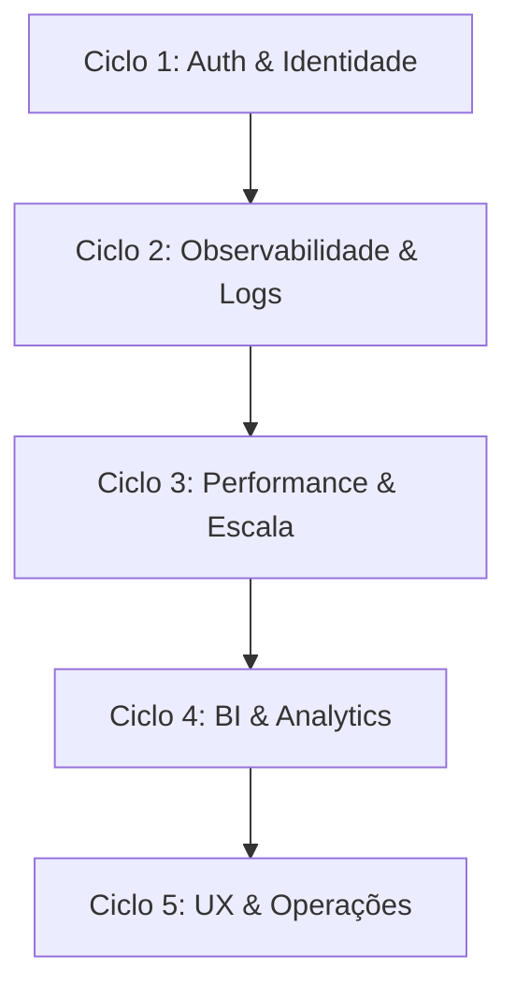

# Roadmap de Evolução Tecnológica — Gourmet Saudável

Este roadmap descreve os próximos ciclos de desenvolvimento e evolução técnica para a plataforma Gourmet Saudável, priorizados de acordo com as necessidades de segurança, escalabilidade, observabilidade, performance, UX Admin, BI e catálogo/operação.

---

## 🗺️ Visão de Ciclos de Desenvolvimento

---

## 🌀 Ciclos e Áreas Priorizadas

### Ciclo 1: Identidade, Sessão & OAuth (Auth P2 & OAuth)
* **Status**: Próximo Ciclo (Prioridade 1).
* **Foco**:
  * **Auth P2**: Exibição de sessões ativas do cliente e painel para "Encerrar sessões em outros dispositivos". Notificação de login em novos navegadores/IPs.
  * **OAuth P1/P2/P3**: Integração do botão "Continuar com Google" nas telas de login/registro. Criação da tabela `user_oauth_accounts` e fluxo seguro de Account Linking baseado em `email_verified` do ID Token do Google, reduzindo riscos de Account Takeover a zero.

### Ciclo 2: Observabilidade e Auditoria Avançada
* **Status**: Planejado (Prioridade 2).
* **Foco**:
  * Interface visual aprimorada na Central de Auditoria para administradores.
  * Alertas em tempo real (Notificações via e-mail ou canais de comunicação interna) para ações com severidade `critical` (ex: Emergency Mode ativado, Loyalty estornado, cupons de altíssimo desconto).
  * Limpeza automatizada de logs antigos de auditoria que excedam o prazo de retenção legal (ex: 2 anos) sem degradar o IO do banco.

### Ciclo 3: Performance & Escala
* **Status**: Planejado (Prioridade 3).
* **Foco**:
  * Indexação e otimização de queries de busca em textos criptografados usando cego-hashing.
  * Cache estratégico de leitura para o cardápio e pratos usando estratégias de revalidação em background.
  * Otimização das queries SQL da listagem de logs para evitar full tables scans em bancos volumosos.

### Ciclo 4: BI & Business Intelligence
* **Status**: Planejado (Prioridade 4).
* **Foco**:
  * Consolidação e sincronização automática em background das tabelas de fatos (`bi_facts`) para visualização de relatórios do admin.
  * Otimização da mutation `syncBI` para rodar via cron-job agendado durante a madrugada.

### Ciclo 5: UX do Administrador & Catálogo / Operações
* **Status**: Planejado (Prioridade 5).
* **Foco**:
  * Substituição das caixas de diálogo nativas do navegador (`window.prompt` e `window.confirm`) por modais flutuantes personalizados React no design system.
  * Facilidades na edição em massa do catálogo de pratos, preços, acompanhamentos e regras de fretes por região.
