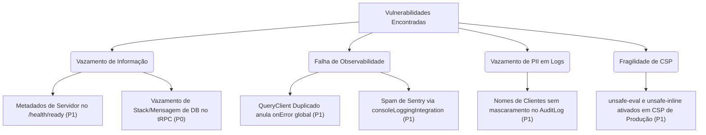

# Relatório de Auditoria Técnica: Observabilidade, Logs, Sentry e Hardening P0
**Projeto:** Gourmet Saudável
**Data:** 13 de Junho de 2026
**Status:** Auditoria Concluída (Apenas Documentação)

---

## 1. Resumo Executivo
Antes de avançar com a implementação de novas funcionalidades no ecossistema da Gourmet Saudável (como IA, assinaturas ou roteirização), foi conduzida uma auditoria técnica focada em **observabilidade, segurança (hardening), logs, Sentry e healthchecks**.

A auditoria identificou vulnerabilidades de vazamento de dados de infraestrutura, redundância de instâncias críticas no client (que anulam mecanismos globais de captura de erros), além de vazamento potencial de PII (dados pessoais) em logs estruturados.

Este relatório detalha os achados classificados em **P0** (correção imediata antes de novas features), **P1** (correção em sprint curta) e **P2** (backlog técnico), com evidências, riscos associados e propostas de correção.

---

## 2. Estado Atual Observado

### 2.1 Observabilidade no Frontend
* **Integração Sentry:** Ativa e configurada na inicialização do client (`client/src/main.tsx`) apenas em ambiente de produção.
* **Captura de Erros:** O client possui uma infraestrutura de captura de erros através de `ErrorBoundary` locais que envolvem áreas críticas de UI (como identificação, entrega, pagamento e resumo).
* **Console Noise:** Existe redundância de instâncias do `QueryClient`. O monitor global de erro configurado em `client/src/_core/trpc.ts` está inativo porque o client utiliza a instância instanciada em `client/src/main.tsx`, que carece de escuta global de erros tRPC. Qualquer falha de query dispara console logs padrão, poluindo o Sentry devido à integração `consoleLoggingIntegration`.

### 2.2 Observabilidade no Backend
* **AuditLogService:** Centralizado e integrado com persistência no banco de dados. Conta com um helper robusto de higienização de logs (`redactSensitiveData`) para impedir escrita de senhas, CPFs, e telefones.
* **Correlation ID:** O backend possui tratamento de `requestId` por requisição e repassa este ID nas mensagens estruturadas de auditoria.
* **Exposição de Erros:** Determinadas rotas da API expõem a mensagem original das exceções do banco de dados ao invés de ocultá-las em um invólucro genérico, representando um risco de exposição estrutural (Information Disclosure).

### 2.3 Healthchecks
* **Status atual:** Existem rotas de `/health/live` e `/health/ready` expostas na raiz HTTP. A rota `/health/ready` valida conexões ativas com o banco MySQL e com o cache Redis, além do status do background worker (BullMQ).
* **Vazamento de Metadados:** A resposta pública do endpoint `/health/ready` expõe o Hostname do servidor físico, PID do processo Node e o Commit SHA atual do sistema, expondo dados internos sem autenticação.

---

## 3. Mapa de Risos por Área



---

## 4. Lista de Achados P0 / P1 / P2

### P0 — Corrigir antes de novas features (Bloqueantes)
* **Achado P0.1:** Vazamento de erros internos e consultas de banco de dados (`error.message`) para o client final em chamadas mutantes do tRPC, como criação de pedido e edição de categorias por administradores.

### P1 — Corrigir em sprint curta (Próxima etapa)
* **Achado P1.1:** Instância duplicada de `QueryClient` no frontend, inutilizando os tratamentos e despachos de eventos globais de erro tRPC (`trpc-error`) configurados no core.
* **Achado P1.2:** Exposição de informações sensíveis de ambiente (`hostname`, `pid`, `build/version`) para qualquer requisitante não autenticado nos endpoints públicos `/health/ready` e `/health/worker`.
* **Achado P1.3:** Vazamento de dados pessoais (PII) sob a chave de nome de usuário (`customerName`, `name`, `nome`) no banco de auditoria, uma vez que as chaves de nome não estão cobertas no filtro `REDACTED_KEYS` de `redact.ts`.
* **Achado P1.4:** Políticas de segurança CSP de produção com as diretivas `'unsafe-inline'` e `'unsafe-eval'` habilitadas em scripts, reduzindo drasticamente a proteção contra Cross-Site Scripting (XSS).
* **Achado P1.5:** Integração de captura automática do console do Sentry (`consoleLoggingIntegration`) em produção disparando spam de logs por qualquer erro de formulário, 401 de visitante ou 429 de rate limits locais.

### P2 — Backlog técnico (Baixo impacto)
* **Achado P2.1:** Desacoplamento incompleto no tratamento de erros do fluxo de logout, gerando falhas silenciosas que mantêm a interface no estado "Logado" caso a requisição HTTP falhe na conexão de rede.
* **Achado P2.2:** Uso desnecessário de casting `as any` em áreas da UI administrativa (ex: `AiScanResultView.tsx` e `StepCustomer.tsx`) para contornar verificações do TypeScript Compiler.

---

## 5. Arquivos Envolvidos
Os arquivos que concentram as vulnerabilidades ou anomalias estruturais auditadas são:

1. [client/src/main.tsx](file:///f:/Site_React/client/src/main.tsx) (Duplicação do QueryClient, CSP, Sentry Config)
2. [client/src/_core/trpc.ts](file:///f:/Site_React/client/src/_core/trpc.ts) (QueryClient inativo, onError listeners mortos)
3. [server/routers/storefront/checkout/index.ts](file:///f:/Site_React/server/routers/storefront/checkout/index.ts) (Vazamento de erro bruto de DB no placeOrder)
4. [server/routers/admin/categories.ts](file:///f:/Site_React/server/routers/admin/categories.ts) (Vazamento de erro bruto de DB no upsert)
5. [server/_core/health.ts](file:///f:/Site_React/server/_core/health.ts) (Disclosures de infraestrutura no ready check)
6. [server/lib/redact.ts](file:///f:/Site_React/server/lib/redact.ts) (Ausência de chaves de nome em PII redaction)
7. [server/_core/security-middleware.ts](file:///f:/Site_React/server/_core/security-middleware.ts) (Production CSP permissiva)
8. [client/src/_core/hooks/useAuth.ts](file:///f:/Site_React/client/src/_core/hooks/useAuth.ts) (Tratamento de erro de logout ineficaz)

---

## 6. Evidência de Cada Achado

### Achado P0.1: Vazamento de erro do banco de dados na resposta tRPC
No backend, o middleware global de tratamento de erros express em `server/_core/index.ts` mascara as falhas com segurança. No entanto, procedimentos tRPC repassam a mensagem original da exceção `error.message`.
* **Evidência 1 ([checkout/index.ts:L305-310](file:///f:/Site_React/server/routers/storefront/checkout/index.ts#L305-L310)):**
```typescript
      } catch (error: unknown) {
        if (error instanceof TRPCError) throw error;

        throw new TRPCError({
          code: "INTERNAL_SERVER_ERROR",
          message:
            error instanceof Error
              ? error.message
              : "Falha crítica no processamento do pedido.",
        });
      }
```
* **Evidência 2 ([categories.ts:L95-98](file:///f:/Site_React/server/routers/admin/categories.ts#L95-L98)):**
```typescript
        throw new TRPCError({
          code: "INTERNAL_SERVER_ERROR",
          message: error instanceof Error ? error.message : "Erro ao processar categoria",
        });
```

---

### Achado P1.1: QueryClient Duplicado e Handlers Globais Inativos
No arquivo `client/src/_core/trpc.ts` existe uma configuração complexa do `QueryClient` contendo disparadores globais para ajudar o usuário com floater de suporte (`trpc-error`):
* **Evidência 1 ([trpc.ts:L11-25](file:///f:/Site_React/client/src/_core/trpc.ts#L11-L25)):**
```typescript
export const queryClient = new QueryClient({
  defaultOptions: {
    queries: {
      refetchOnWindowFocus: false,
      retry: false,
      staleTime: 5 * 60 * 1000,
      // @ts-ignore - Captura erros globais para disparar o floater de ajuda
      onError: (err: unknown) => {
        if (typeof window !== "undefined") {
          window.dispatchEvent(new Event("trpc-error"));
        }
        console.error("🔍 tRPC Query Error:", err);
      }
    },
    ...
```
No entanto, no ponto de entrada da aplicação, um segundo `queryClient` local é criado e injetado diretamente nos providers, ignorando a configuração acima:
* **Evidência 2 ([main.tsx:L30-38](file:///f:/Site_React/client/src/main.tsx#L30-L38)):**
```typescript
const queryClient = new QueryClient({
  defaultOptions: {
    queries: {
      refetchOnWindowFocus: false,
      retry: 1,
      staleTime: 1000 * 60 * 5,
      throwOnError: false,
    },
  },
});
```
* **Evidência 3 ([main.tsx:L72-75](file:///f:/Site_React/client/src/main.tsx#L72-L75)):**
```typescript
        <trpc.Provider client={trpcClient} queryClient={queryClient}>
          <QueryClientProvider client={queryClient}>
            <App />
```

---

### Achado P1.2: Exposição de Metadados Privados no /health/ready público
O endpoint `/health/ready` retorna a resposta agregada contendo a chave `worker` sem qualquer proteção de privilégio:
* **Evidência 1 ([health.ts:L104-112](file:///f:/Site_React/server/_core/health.ts#L104-L112)):**
```typescript
  return {
    statusCode: ready ? 200 : 503,
    body: {
      status: ready ? (degraded ? "degraded" : "ready") : "not_ready",
      checks,
      worker,
      timestamp: new Date().toISOString(),
    },
  };
```
O objeto `worker` extrai as informações do servidor diretamente do processo Node em execução, incluindo detalhes como hostname, PID e hashes:
* **Evidência 2 ([observability.ts:L138-147](file:///f:/Site_React/server/workers/observability.ts#L138-L147)):**
```typescript
export function buildWorkerHeartbeatPayload(): WorkerHeartbeatPayload {
  return {
    timestamp: new Date().toISOString(),
    pid: process.pid,
    hostname: os.hostname(),
    queues: [NUTRI_QUEUE_NAME, BI_QUEUE_NAME],
    version: getRuntimeVersion(),
    build: getRuntimeBuild(),
  };
}
```

---

### Achado P1.3: Vazamento de Dados Pessoais (Nomes) em Logs de Auditoria
A função de higienização de logs estruturados `redactSensitiveData` remove dados identificados como CPF, E-mail, senhas, telefones e endereços. No entanto, nomes de usuários sob chaves padrão não estão no radar de sanitização:
* **Evidência 1 ([redact.ts:L31-39](file:///f:/Site_React/server/lib/redact.ts#L31-L39)):**
```typescript
const REDACTED_KEYS = new Set([
  ...CPF_KEYS,
  ...PHONE_KEYS,
  ...ZIP_KEYS,
  ...SECRET_KEYS,
  ...ADDRESS_KEYS,
  ...PAYMENT_KEYS,
  "email",
]);
```
Como as chaves `"name"`, `"customerName"`, e `"nome"` não constam em `REDACTED_KEYS`, payloads contendo essas informações são persistidos na íntegra em texto limpo no banco de logs.

---

### Achado P1.4: CSP de Produção Permissiva com 'unsafe-eval' e 'unsafe-inline'
Scripts em produção rodam sob uma diretiva CSP que afrouxa as defesas de execução de injeção de código:
* **Evidência 1 ([security-middleware.ts:L31-33](file:///f:/Site_React/server/_core/security-middleware.ts#L31-L33)):**
```typescript
      const productionCSP = `
        default-src 'self';
        script-src 'self' 'unsafe-inline' 'unsafe-eval'
```

---

### Achado P1.5: Spam no Sentry devido à captura de logs do console
O client captura erros e warnings lançados no console de forma irrestrita em produção, convertendo qualquer query falha (ex: 401 temporário ao tentar ler sessão de visitante) em issue do Sentry:
* **Evidência 1 ([main.tsx:L21](file:///f:/Site_React/client/src/main.tsx#L21)):**
```typescript
Sentry.consoleLoggingIntegration({ levels: ["error", "warn"] }),
```

---

### Achado P2.1: Tratamento de Erros Frágil no Fluxo de Logout
Se a chamada de logout falhar com status code diferente de `UNAUTHORIZED` (ex: 502/503 ou Timeouts), o client simplesmente ignora e não executa a limpeza local, deixando a interface presa no estado logado:
* **Evidência 1 ([useAuth.ts:L151-157](file:///f:/Site_React/client/src/_core/hooks/useAuth.ts#L151-L157)):**
```typescript
    onError: (err) => {
      if (err.shape?.data?.code === "UNAUTHORIZED") {
        clearUserId();
        utils.auth.me.setData(undefined, null);
        window.location.replace("/");
      }
    },
```

---

## 7. Risco de Negócio

| Achado | Descrição do Risco | Impacto Financeiro/Reputação |
| :--- | :--- | :--- |
| **P0.1: Vazamento de Erros brutas de DB** | Atacantes podem extrair nomes de tabelas, sintaxe SQL, e restrições de chaves primárias/estrangeiras do banco de dados, facilitando a exploração direcionada de SQL Injections ou abusos de lógica de banco. | **Alto** (Pode resultar em vazamento de banco de dados e quebra de conformidade de segurança). |
| **P1.1: QueryClient Duplicado** | O sistema perde a habilidade de alertar o cliente sobre erros de rede de forma amigável no painel flutuante, aumentando o abandono de carrinho se o usuário achar que a página travou. | **Médio** (Afeta negativamente a taxa de conversão no checkout). |
| **P1.2: Metadados no /health** | Exposição pública do Hostname interno da máquina (ex: `render-instance-xx`) e do PID do processo Node. Facilita ataques focados em infraestrutura de rede interna e inundações direcionadas baseadas no hash de build. | **Médio** (Facilitação de engenharia social ou exploração de infraestrutura). |
| **P1.3: Vazamento de PII em Logs** | Gravar nomes completos dos clientes no banco de dados de auditoria em texto limpo fere as diretrizes da LGPD (Lei Geral de Proteção de Dados) no Brasil, onde dados pessoais identificáveis devem ser criptografados ou anonimizados. | **Alto** (Risco de sanções legais e multas regulatórias da LGPD). |
| **P1.4: CSP Permissiva** | Reduz a barreira para ataques de injeção de script (XSS) no frontend, abrindo margem para roubo de sessão ou manipulação visual do checkout se extensões ou scripts de terceiros forem comprometidos. | **Médio** (Integridade do fluxo de checkout do usuário). |

---

## 8. Recomendação de Correção

### Para P0.1 (Vazamento de Erros):
Adotar o helper `logger.error` no backend para registrar a stack e o erro bruto, mas sempre retornar uma mensagem segura e genérica nas falhas internas do tRPC.
*Exemplo:*
```typescript
} catch (error: unknown) {
  if (error instanceof TRPCError) throw error;
  logger.error({ err: error }, "Falha crítica ao criar pedido");
  throw new TRPCError({
    code: "INTERNAL_SERVER_ERROR",
    message: "Ocorreu um erro interno ao processar seu pedido. Por favor, tente novamente.",
  });
}
```

### Para P1.1 (QueryClient Duplicado):
Unificar a inicialização do `QueryClient` em um único ponto ou importar a instância configurada em `client/src/_core/trpc.ts` para dentro do arquivo `client/src/main.tsx`.

### Para P1.2 (Metadata Disclosure no Healthcheck):
Limitar a saída do `/health/ready` e `/health/worker` públicos apenas para os status simplificados de cada dependência (ex: `{ database: "ok", redis: "ok", worker: "ok" }`). O objeto de diagnóstico completo com hostname e PID deve ficar restrito à procedure tRPC `health.checkStatus`, que exige autenticação prévia de operador.

### Para P1.3 (Logs com PII):
Adicionar `"name"`, `"customername"`, `"nome"`, `"nameindex"` e `"customeremail"` à lista `REDACTED_KEYS` no arquivo `server/lib/redact.ts`. Isso garante que nomes de usuários também passem por processos de mascaramento parcial antes de serem logados de forma estruturada.

### Para P1.4 (CSP de Produção):
1. Avaliar se o Vite realmente necessita de `'unsafe-eval'` em ambiente de produção (geralmente não é necessário, a menos que existam compiladores de template dinâmicos no runtime).
2. Remover `'unsafe-eval'` e rolar scripts inline estáticos com hash ou nonce dinâmico para eliminar `'unsafe-inline'`.

---

## 9. O Que NÃO Deve Ser Corrigido Agora
Conforme as regras estabelecidas da auditoria técnica:
1. **Lógica de Checkout:** Não alterar de forma alguma as condicionais de cupom, frete, endereços ou processamento de itens do carrinho.
2. **Payloads e Schemas de Banco:** Nenhuma coluna deve ser alterada ou criada no Drizzle Schema.
3. **Conversão de Procedures:** Não alterar procedimentos públicos para protegidos ou vice-versa.
4. **Refatorações Estéticas:** Não mexer em estilos Visuais ou componentes de UI agora.

---

## 10. Proposta de Próxima Sprint de Correção (Escopo Reduzido)
Propõe-se uma sprint de correção curta (2 a 3 dias) priorizando os achados cruciais com risco direto de vazamento ou conformidade:

* **Dia 1 (Hardening e LGPD):**
  - Implementar higienização de mensagens de banco de dados nos endpoints tRPC identificados (`checkout` e `categories`).
  - Atualizar `server/lib/redact.ts` para mascarar nomes de clientes nos logs de auditoria.
* **Dia 2 (Observabilidade e Configurações):**
  - Unificar instâncias do `QueryClient` para ativar o monitor global de erros no frontend.
  - Ajustar `/health/ready` no backend para mascarar `hostname`, `pid` e metadados de build na rota pública.
* **Dia 3 (Testes e Validação):**
  - Rodar suíte de testes de integração (`pnpm test:run`) e garantir que a higienização de dados e roteamento de erros não impactou as specs de guest checkout e RBAC.
